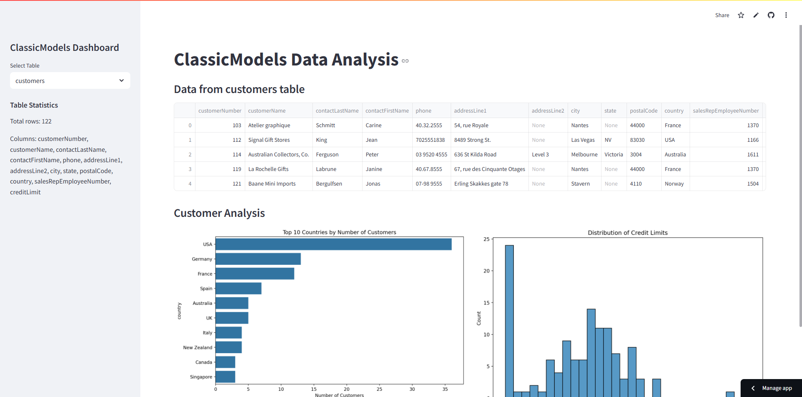

# MySQL to SQLite3 마이그레이션 및 Streamlit 대시보드 프로젝트

이 프로젝트는 기존의 MySQL 데이터베이스를 SQLite3로 마이그레이션하고,  
Streamlit을 활용해 데이터베이스 내용을 시각화하는 대시보드를 구축하여  
간편하게 데이터를 조회할 수 있도록 만든 프로젝트입니다.

## 프로젝트 개요

1. **MySQL → SQLite3 마이그레이션**
   - MySQL의 `classicmodels` 데이터베이스를 SQLite3로 변환했습니다.
   - [`mysql-to-sqlite3`](https://techouse.github.io/mysql-to-sqlite3/) 라이브러리를 사용하여 마이그레이션을 수행했습니다.
   - 다음 명령어를 사용해 변환을 완료했습니다:
    ```bash
     $ pip install mysql-to-sqlite3
     $ mysql2sqlite -f classicmodels.sqlite -d classicmodels -u root -p
    ```
    - 변환된 `.sqlite` 파일은 이후 Streamlit 대시보드에서 사용되었습니다.

2. **대시보드 구현**
   - `app.py`에서 **Streamlit**을 활용해 테이블 정보를 시각적으로 확인할 수 있는 대시보드를 개발했습니다.
   - SQLite 데이터베이스(`classicmodels.sqlite`)를 로드하고, 각 테이블을 탐색할 수 있도록 구성했습니다.
   - 사이드바에서 테이블을 선택하면 해당 데이터가 미리보기로 표시되며, 주요 테이블에는 다음과 같은 시각화 기능이 포함되어 있습니다:
     - **Customers**: 국가별 고객 수, 신용한도 분포
     - **Products**: 제품 라인별 평균 가격, 재고 수준 박스플롯
     - **Orders**: 월별 주문 수 추이, 주문 상태 분포
     - **OrderDetails**: 주문 금액 히스토그램, 주문 수량 박스플롯
   - 각 테이블의 통계 정보(행 수, 열 목록)는 사이드바에 요약되어 표시됩니다.

3. **배포**
   - 테스트 완료 후 [Streamlit](https://streamlit.io/cloud) 플랫폼을 이용해 웹으로 배포했습니다.
   - GitHub 계정과 연동하여 자동 배포를 설정했습니다.

## 대시보드 미리보기



## Streamlit 앱 바로가기

[대시보드 실행하기](https://lgu6-mysql-crud-test-kfgbqdcgvkjwkb9t6iayzz.streamlit.app/)

## 설치 및 실행 방법

```bash
# 가상환경 생성 및 진입 (선택사항)
pip install virtualenv
virtualenv venv
source venv\Scripts\activate

# 패키지 설치
pip install -r requirements.txt

# Streamlit 앱 실행
streamlit run app.py